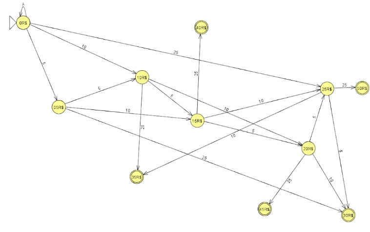

# 📚 Máquina de Vendas 

Este projeto foi desenvolvido como trabalho avaliativo para a disciplina de **[ LINGUAGENS FORMAIS E AUTÔMATOS]**. 

## 🎯 Objetivo
O objetivo principal deste sistema é usar a lógica das máquinas de estados, linguagens formais e autômatos para simular o funcionamento lógico e visual de uma máquina de vendas automática (Vending Machine).

## 🛠️ Tecnologias Utilizadas
* **HTML5:** Estrutura da máquina e elementos visuais.
* **CSS3:** Estilização, design com tema industrial e animações (moedas e mensagens).
* **JavaScript:** Lógica de estados, acúmulo de saldo, cálculo matemático de troco e validações de regras de negócio.
* **JFLAP:** Para a criação da lógica por trás das funcionalidades do sistema criado.

## 📝 Funcionalidades
* Sistema de inserção de moedas ($0.05, $0.10, $0.25) com limite de segurança estabelecido em $0.30.
* Tela de status digital embutida na máquina.
* Processamento de compras com verificação automática de saldo suficiente.
* Compartimento de troco inteligente com opções de reaproveitar dinheiro (+ Saldo) ou guardá-lo (Retirar).
* Tratamento de transbordo: rejeição automática de moedas que ultrapassem o limite de saldo.

**Lógica criada no Jflap**

## 👥 Equipe
* **Matheus Varela de Paula**
* **Zack Zayry Gomes Da Silva**